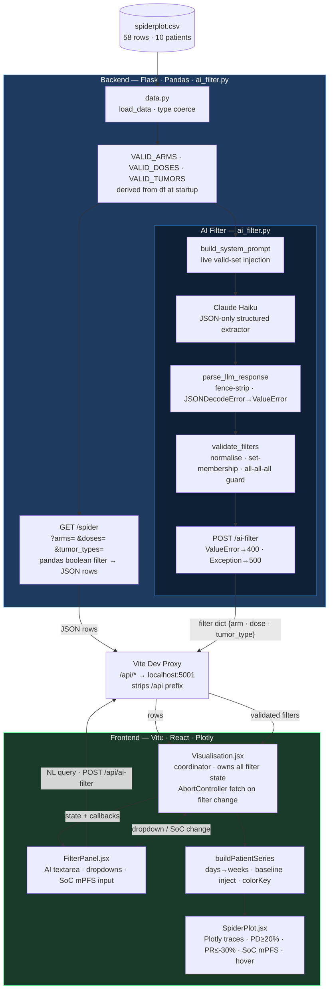

# Spider Plot Dashboard — Hummingbird Take-Home

Clinical trial tumour-size spider plot with AI-powered natural language filtering.  
Flask + Pandas backend · Vite + React frontend · Plotly chart · Claude Haiku AI filter.


---

## Quick Start

**Prerequisites**

| Tool | Version |
|------|---------|
| Python | 3.10+ |
| Node | 18+ |
| npm | 9+ |

> macOS/Linux only. The `npm run dev` script calls `backend/venv/bin/flask` directly — on Windows that path does not exist.

```bash
# Clone
git clone <repo-url> && cd <repo-name>

# Python venv
cd backend && python3 -m venv venv && source venv/bin/activate
pip install -r requirements.txt && cd ..

# API key (AI filter only — rest of app works without it)
echo "ANTHROPIC_API_KEY=sk-ant-..." > backend/.env

# Frontend deps
cd frontend && npm install && cd ..

# Run
npm run dev
```

Opens at [http://localhost:5173](http://localhost:5173). Flask runs on port 5001; Vite proxies `/api/*` → Flask, stripping the prefix before it reaches Flask routes.

**Tests**

```bash
backend/venv/bin/pytest backend/tests/ -v   # pytest
cd frontend && npx vitest run               # vitest
```

---

## Architecture

Full-stack pipeline: CSV on disk → Flask/Pandas API → Vite dev proxy → React coordinator → Plotly spider plot. The AI filter is a separate branch that translates natural language into the same filter state the manual dropdowns write.



---

### Design Decisions

| # | Decision | Tradeoff |
|---|----------|----------|
| 1 | **Hermetic test fixtures** — `conftest.py` patches all four module-level constants (`df`, `VALID_ARMS`, `VALID_DOSES`, `VALID_TUMORS`) so fixture data is the only source of truth during tests | Fixture structure must stay in sync with how `app.py` derives those sets — no compile-time check enforces this |
| 2 | **O(n+m) baseline injection** — `buildPatientSeries` builds a `Set` of day-0 subjects in one pass, then does O(1) lookups to decide whether to inject a synthetic baseline, rather than scanning all rows per patient | Correctness over micro-optimisation at 58 rows; the `Set` key assumes subject IDs are consistently cased and trimmed |
| 3 | **`AbortController` with no state calls on abort** — `setLoading(false)` is moved out of `finally` so aborted fetches never update state on an unmounted component; React 18 StrictMode double-mount is handled cleanly | A `cancelled` flag and `controller.abort()` are two independent mechanisms doing the same job — intentional redundancy, minor cognitive overhead |
| 4 | **Valid sets derived from `df` at startup** — `VALID_ARMS`, `VALID_DOSES`, `VALID_TUMORS` are computed from the CSV at server start and injected into both route validation and the AI filter system prompt, so they stay in sync automatically | `FilterPanel.jsx` hardcodes the dropdown options — if the CSV gains a new arm the backend accepts it but the UI has no option for it without an `/api/meta` endpoint |
| 5 | **Cross-module contract test for `colorKey`** — a single test imports both `buildPatientSeries` and `COLOR_MAP` and asserts every produced `colorKey` has a matching entry, catching format drift (`'ARM A 1800mg'` vs `'ARM A 1800 mg'`) that would silently render lines grey | Tests both modules simultaneously — a bug in `constants.js` surfaces as a transform test failure, which can be misleading |

---

## Tech Stack

| Layer | Choice | Why |
|-------|--------|-----|
| Backend | Flask + Pandas | Lightweight REST; Pandas handles CSV type coercion and schema validation without custom parsing |
| Frontend | Vite + React | Fast HMR; React Router for two-page navigation without a full framework |
| Chart | Plotly.js (`react-plotly.js`) | Reference lines, hover templates, and legend grouping built-in; D3 would require building all of this manually |
| Styling | Tailwind CSS | Utility-first; no component library needed at this scale |
| AI | Claude Haiku via Anthropic SDK | Smallest/fastest Claude model; constrained JSON-only system prompt makes output mechanically validatable |

---

## Troubleshooting

**Flask won't start — `spiderplot.csv not found`**  
The CSV must be at `backend/spiderplot.csv`. It is already committed — if it is missing, re-clone or copy: `cp assignment/spiderplot.csv backend/`.

**`npm run dev` fails with `flask: command not found`**  
The script calls `backend/venv/bin/flask`. Set up the venv first: `cd backend && python3 -m venv venv && source venv/bin/activate && pip install -r requirements.txt`.

**AI filter shows "Filtering…" for 10+ seconds then fails**  
The backend timeout is 5s × 2 retries = 10s; the frontend aborts at 12s. Under Anthropic API latency spikes, users will wait the full duration. Check `backend/.env` for a valid key first — an invalid key returns 401 immediately, not a timeout.

**AI filter returns "Could not extract a specific filter"**  
The filter only supports arm, dose, and tumour type. Queries like "show patients with more than 20% tumour growth" are explicitly unsupported — the model sets `"unsupported": true` and the backend rejects it. To reset all filters, use the Reset All button rather than asking the AI.
