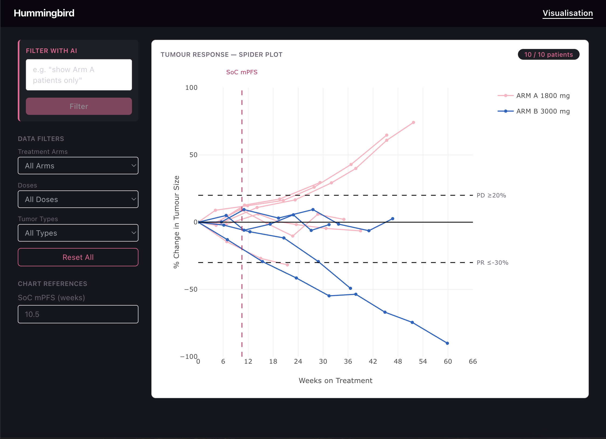
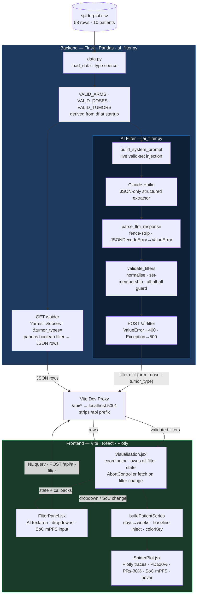

# Spider Plot Dashboard — Hummingbird Take-Home

Clinical trial tumour-size spider plot with AI-powered natural language filtering.  
Flask + Pandas backend · Vite + React frontend · Plotly chart · Claude Haiku AI filter.



---

## Quick Start

**Prerequisites**

| Tool | Version |
|------|---------|
| Python | 3.10+ |
| Node | 18+ |
| npm | 9+ |

> macOS/Linux only. The `npm run dev` script calls `backend/venv/bin/flask` directly — on Windows that path does not exist.

```bash
# Clone
git clone <repo-url> && cd <repo-name>

# Python venv
cd backend && python3 -m venv venv && source venv/bin/activate
pip install -r requirements.txt && cd ..

# API key (AI filter only — rest of app works without it)
echo "ANTHROPIC_API_KEY=sk-ant-..." > backend/.env

# Frontend deps
cd frontend && npm install && cd ..

# Run
npm run dev
```

Opens at [http://localhost:5173](http://localhost:5173). Flask runs on port 5001; Vite proxies `/api/*` → Flask, stripping the prefix before it reaches Flask routes.

**Tests**

```bash
backend/venv/bin/pytest backend/tests/ -v   # pytest
cd frontend && npx vitest run               # vitest
```

---

## Architecture

Full-stack pipeline: CSV on disk → Flask/Pandas API → Vite dev proxy → React coordinator → Plotly spider plot. The AI filter is a separate branch that translates natural language into the same filter state the manual dropdowns write.



---

### Design Decisions

Six decisions that shaped the codebase — each with the tradeoff it leaves open.

---

#### 1. Hermetic test fixtures: patch all four module constants, not just `df`

`app.py` derives `VALID_ARMS`, `VALID_DOSES`, and `VALID_TUMORS` from `df` once at import time, before any test runs. Patching only `df` in a fixture leaves those three validation sets pointing at the real CSV's values for the entire test session.

The `conftest.py` client fixture patches all four:

```python
monkeypatch.setattr(app_module, 'df', sample_df)
monkeypatch.setattr(app_module, 'VALID_ARMS',  {str(a) for a in sample_df['arm'].unique()})
monkeypatch.setattr(app_module, 'VALID_DOSES', {int(d) for d in sample_df['dose'].unique()})
monkeypatch.setattr(app_module, 'VALID_TUMORS', {str(t) for t in sample_df['tumor_type'].unique()})
```

Without this, a test adding `arm='C'` to the fixture would still be rejected by `VALID_ARMS = {'A', 'B'}` derived from the real CSV — the test would pass for the wrong reason. The fixture data has to be the *only* source of truth for every module-level constant the route reads from.

**Tradeoff:** The test fixture must stay structurally consistent with how `app.py` derives those sets. If `VALID_DOSES` ever changed from `{int(d) ...}` to something else (e.g. strings), the fixture would silently diverge. There is no compile-time check enforcing this consistency.

---

#### 2. O(n+m) baseline injection — correct algorithm at 58 rows

`buildPatientSeries` needs to know which patients have a real day-0 row so it can inject a synthetic baseline only for those who don't.

The naïve approach scans all rows per patient:

```js
// O(patients × rows) — wrong
rows.some(r => r.subject_id === id && Number(r.days) === 0)
```

The implementation builds a `Set` in one pass, then does O(1) lookups:

```js
// O(rows) build + O(1) per patient — correct
const dayZeroSubjects = new Set(
  rows.filter(r => Number(r.days) === 0).map(r => r.subject_id)
)
```

At 58 rows the difference is microseconds. The decision is about defaulting to the correct algorithm rather than the minimum-viable one. The wrong algorithm also has a semantic problem: `r.days` is checked before division, not `p.weeks` after — because a future CSV with fractional-day entries could produce `0.001 / 7 = 0.000143`, which would fail a `=== 0` check on the derived value and inject a duplicate baseline.

**Tradeoff:** The `Set` is built from raw `r.days` values. If the API ever returned `days` as a float (e.g. `0.0` instead of `0`), `Number("0.0") === 0` is still `true`, so the check holds. But the string equality of the `subject_id` key assumes IDs are always consistently cased and trimmed — a CSV with mixed-case IDs would group one patient as two.

---

#### 3. `AbortController` without state calls on the abort path

React 18 `StrictMode` deliberately mounts every component twice in development to surface side effects. Without cleanup, the first fetch fires, React unmounts, React remounts, the second fetch fires — both call `setRows` on an instance that no longer exists.

The naïve fix adds `AbortController` but puts `setLoading(false)` in a `finally` block. `finally` runs unconditionally — including when the request is aborted. The state call still fires on the dead instance.

The implementation moves `setLoading(false)` out of `finally` entirely:

```js
.catch(err => {
  if (err.name === 'AbortError') return   // abort path: no state calls
  setError(err.message)
  setLoading(false)
})
return () => controller.abort()
```

Only the non-abort error path and the success path update state. The abort path returns immediately.

**Tradeoff:** `Visualisation.jsx` uses an async IIFE pattern (`(async () => { ... })()`) with a `cancelled` flag instead of direct `.then/.catch`. Both are defensible; the IIFE makes `await` syntax available but adds indirection. The `cancelled` flag and `controller.abort()` are now two independent mechanisms doing conceptually the same thing — either one would prevent stale state updates. The redundancy is intentional (cancel on navigation, abort the network request) but adds cognitive overhead.

---

#### 4. `VALID_ARMS / VALID_DOSES / VALID_TUMORS` derived from `df` at startup

The set of legal filter values is a fact about the dataset, not a constant in the application code.

```python
VALID_ARMS  = {str(a) for a in df['arm'].unique()}
VALID_DOSES = {int(d) for d in df['dose'].unique()}
VALID_TUMORS = {str(t) for t in df['tumor_type'].unique()
```

If the CSV gains a third arm, `VALID_ARMS` updates automatically on the next server start. A hardcoded `VALID_ARMS = {'A', 'B'}` would reject valid data silently — returning 400 for a value that exists in the database — with no error visible to the developer.

The sets are also used in the AI filter's system prompt via `build_system_prompt`. When the valid sets update, the prompt updates too — the LLM is always constrained to values that actually exist in the data.

**Tradeoff:** `FilterPanel.jsx` hardcodes `ARM_OPTIONS`, `DOSE_OPTIONS`, and `TUMOR_OPTIONS`. The backend validates against live data; the frontend dropdowns are frozen to what was known at write time. If the CSV gains a new arm, backend validation passes but the dropdown has no option for it — users can only reach the new arm via the AI filter or a direct URL. Fixing this requires an `/api/meta` endpoint or accepting the frontend is a fixed UI for a fixed dataset.

---

#### 5. `colorKey` → `COLOR_MAP` cross-module contract test

`buildPatientSeries` produces a `colorKey` string per patient (e.g. `'ARM A 1800 mg'`). `SpiderPlot` looks that key up in `COLOR_MAP` from `constants.js`. These two files are authored independently and have no compile-time relationship.

A typo in either — `'ARM A 1800mg'` vs `'ARM A 1800 mg'` — passes all transform tests and all chart tests, then renders every affected line as `#888` grey with no console error.

The test suite adds a cross-module check:

```js
import { buildPatientSeries } from './transformData'
import { COLOR_MAP } from '../constants'

test('colorKey matches a COLOR_MAP entry for every arm+dose combination', () => {
  const series = buildPatientSeries(rows)
  series.forEach(patient => {
    expect(COLOR_MAP[patient.colorKey]).toBeDefined()
  })
})
```

This test owns the contract between the two modules. If either side drifts, it fails before the chart exists.

**Tradeoff:** The test imports from `constants.js`, which means it is testing both the transform logic and the constants file simultaneously. A bug in `constants.js` (e.g. wrong key format) would fail this test with a misleading error message pointing at the transform. The test is a cross-module integration check, not a pure unit test — which is the right tool for this specific failure mode, but worth being clear about.

---

## Tech Stack

| Layer | Choice | Why |
|-------|--------|-----|
| Backend | Flask + Pandas | Lightweight REST; Pandas handles CSV type coercion and schema validation without custom parsing |
| Frontend | Vite + React | Fast HMR; React Router for two-page navigation without a full framework |
| Chart | Plotly.js (`react-plotly.js`) | Reference lines, hover templates, and legend grouping built-in; D3 would require building all of this manually |
| Styling | Tailwind CSS | Utility-first; no component library needed at this scale |
| AI | Claude Haiku via Anthropic SDK | Smallest/fastest Claude model; constrained JSON-only system prompt makes output mechanically validatable |

---

## Troubleshooting

**Flask won't start — `spiderplot.csv not found`**  
The CSV must be at `backend/spiderplot.csv`. It is already committed — if it is missing, re-clone or copy: `cp assignment/spiderplot.csv backend/`.

**`npm run dev` fails with `flask: command not found`**  
The script calls `backend/venv/bin/flask`. Set up the venv first: `cd backend && python3 -m venv venv && source venv/bin/activate && pip install -r requirements.txt`.

**AI filter shows "Filtering…" for 10+ seconds then fails**  
The backend timeout is 5s × 2 retries = 10s; the frontend aborts at 12s. Under Anthropic API latency spikes, users will wait the full duration. Check `backend/.env` for a valid key first — an invalid key returns 401 immediately, not a timeout.

**AI filter returns "Could not extract a specific filter"**  
The filter only supports arm, dose, and tumour type. Queries like "show patients with more than 20% tumour growth" are explicitly unsupported — the model sets `"unsupported": true` and the backend rejects it. To reset all filters, use the Reset All button rather than asking the AI.
